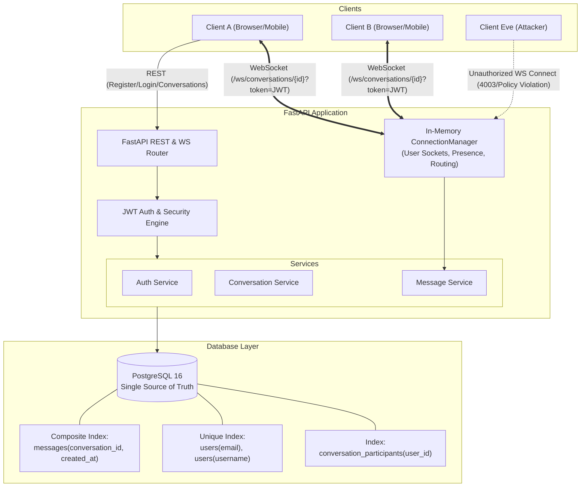
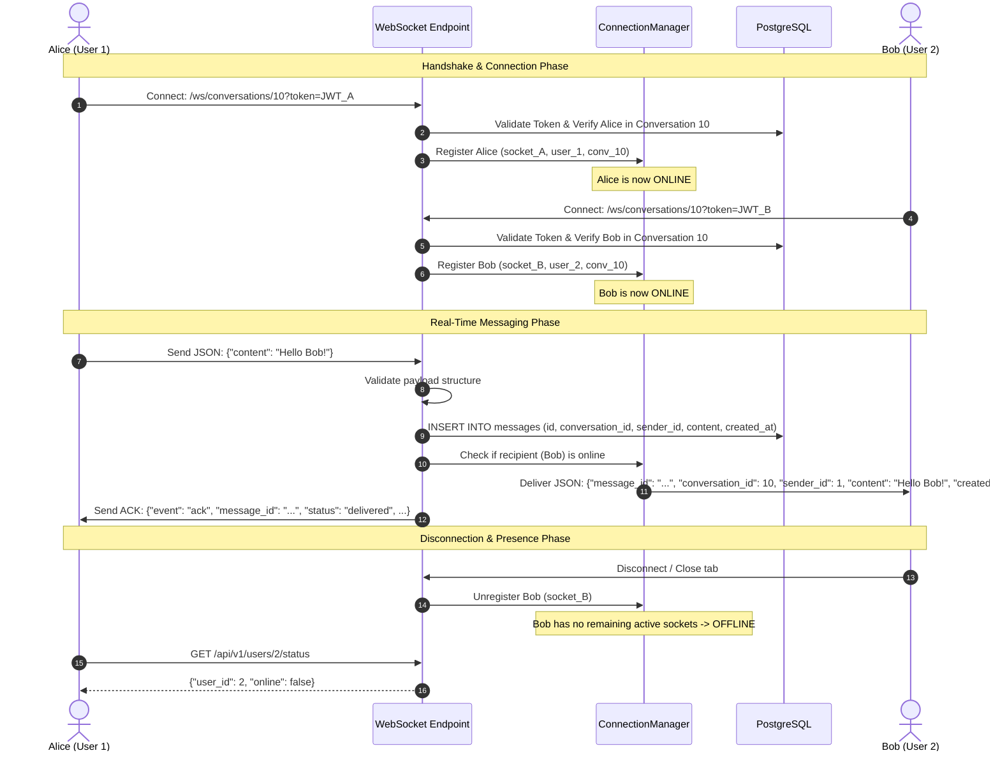

# Real-Time Chat Application Backend

A high-performance, production-grade real-time messaging backend engineered with **Python 3.12**, **FastAPI**, **WebSockets**, **PostgreSQL**, **SQLAlchemy 2.x (Async)**, and **Docker Compose**.

Built to demonstrate scalable backend engineering principles: persistent bidirectional WebSocket streaming, concurrency management, JWT authentication & authorization, strict multi-tenant conversation isolation, indexed PostgreSQL message queries, and automated database migrations.

---

## 1. Overview

This project implements the complete backend architecture for a real-time one-to-one messaging system. It avoids toy in-memory architectures by treating PostgreSQL as the single source of truth for all message histories and conversations, while managing ephemeral real-time presence and socket routing in an asynchronous, non-blocking connection pool.

### Core Capabilities:
- **Bidirectional WebSocket Messaging**: Full-duplex messaging with sub-millisecond in-process routing.
- **Stateful In-Memory Connection Manager**: Tracks active sockets and multi-device presence without saturating the database with ephemeral heartbeat writes.
- **Strict Multi-Tenant Security**: Role-based access control (RBAC) ensuring users can only read, connect, or stream messages for conversations they participate in.
- **Indexed Relational Schema**: Optimized queries for chronological message history using composite B-Tree indexing.
- **Containerized Infrastructure**: Zero-configuration deployment via Docker and Docker Compose with database readiness healthchecks and automated Alembic schema migrations.

---

## 2. System Architecture



---

## 3. Tech Stack

| Technology | Purpose | Key Details |
| :--- | :--- | :--- |
| **Python 3.12+** | Core runtime | High-performance asynchronous runtime |
| **FastAPI** | Web framework | Native async handlers, WebSocket routing, OpenAPI generation |
| **WebSockets** | Real-time protocol | Full-duplex, persistent client-server communication |
| **PostgreSQL 16** | Relational Database | ACID transactional storage, foreign key cascades, indexing |
| **SQLAlchemy 2.x** | Async ORM | `asyncpg` engine, `Mapped` typing, query optimization |
| **Alembic** | Schema Migrations | Declarative schema revision tracking and migration rollbacks |
| **Pydantic v2** | Data Validation | High-throughput data parsing and serialization |
| **PyJWT & Passlib** | Authentication | HS256 JWT signature verification and bcrypt password hashing |
| **Docker & Compose** | Containerization | Multi-container composition with healthcheck dependencies |
| **pytest & HTTPX** | Testing Framework | Comprehensive unit and integration test suite with WebSocket support |

---

## 4. Project Structure

```
real-time-chat/
│
├── app/
│   ├── main.py                     # Application entrypoint, CORS, lifespan & static mounting
│   │
│   ├── api/
│   │   └── v1/
│   │       ├── router.py           # Consolidated v1 API router
│   │       └── endpoints/
│   │           ├── auth.py         # Authentication endpoints (register, login, /me)
│   │           ├── users.py        # Public profile & real-time online status
│   │           ├── conversations.py# 1-to-1 conversation creation & history queries
│   │           └── websocket.py    # WebSocket endpoint with JWT auth & ACK delivery
│   │
│   ├── core/
│   │   ├── config.py               # Pydantic Settings management (.env parsing)
│   │   └── security.py             # Bcrypt hashing & JWT encoding/decoding
│   │
│   ├── db/
│   │   ├── session.py              # Async SQLAlchemy engine & session factory
│   │   └── models.py               # Declarative models, constraints & composite indexes
│   │
│   ├── schemas/
│   │   ├── auth.py                 # Pydantic validation for auth & tokens
│   │   ├── user.py                 # Public/private user schemas & status
│   │   ├── conversation.py         # Conversation request/response models
│   │   └── message.py              # Message models, pagination & WebSocket payloads
│   │
│   ├── services/
│   │   ├── auth.py                 # User creation, authentication & JWT dependencies
│   │   ├── conversation.py         # 1-to-1 conversation lifecycle & authorization
│   │   └── message.py              # Message persistence & paginated retrieval
│   │
│   ├── websocket/
│   │   └── manager.py              # Thread-safe in-memory connection & presence manager
│   │
│   └── static/
│       └── index.html              # Lightweight browser-based WebSocket test client
│
├── tests/
│   ├── conftest.py                 # Pytest fixtures, test database setup & client overrides
│   ├── test_auth.py                # Auth registration, login & token validation tests
│   ├── test_conversations.py       # Conversation creation & 403 authorization checks
│   ├── test_messages.py            # Message persistence & pagination tests
│   └── test_websocket.py           # Dual-client WebSocket delivery, ACK & presence tests
│
├── alembic/
│   ├── env.py                      # Async migration runner
│   ├── script.py.mako              # Migration script template
│   └── versions/
│       └── 0001_initial_schema.py  # Initial tables, constraints, and indexes
│
├── Dockerfile                      # Python 3.12-slim optimized container build
├── docker-compose.yml              # Multi-container orchestration (api + postgres)
├── .env.example                    # Environment variable template
├── .gitignore                      # Git exclusion rules
├── alembic.ini                     # Alembic configuration
├── pyproject.toml                  # Python package specifications & dependencies
├── README.md                       # Architectural documentation & operational guide
└── Makefile                        # Developer productivity shortcuts
```

---

## 5. Database Schema & Indexing Strategy

### Tables and Constraints

```
   +------------------------------------+          +------------------------------------+
   |               users                |          |           conversations            |
   +------------------------------------+          +------------------------------------+
   | PK id             INTEGER          |<----+    | PK id             INTEGER          |<----+
   |    username       VARCHAR(50) [UQ] |     |    |    created_at     TIMESTAMPTZ      |     |
   |    email          VARCHAR(255)[UQ] |     |    +------------------------------------+     |
   |    password_hash  VARCHAR(255)     |     |                      |                        |
   |    created_at     TIMESTAMPTZ      |     |                      |                        |
   +------------------------------------+     |                      |                        |
                     |                        |                      |                        |
                     |                        |                      |                        |
                     v                        |                      v                        |
   +------------------------------------+     |    +------------------------------------+     |
   |     conversation_participants      |     |    |              messages              |     |
   +------------------------------------+     |    +------------------------------------+     |
   | PK,FK conversation_id  INTEGER     |-----+    | PK id             VARCHAR(36)      |     |
   | PK,FK user_id          INTEGER     |          | FK conversation_id INTEGER         |-----+
   | UQ(conversation_id, user_id)       |          | FK sender_id       INTEGER         |-----+
   +------------------------------------+          |    content         TEXT            |
                                                   |    created_at      TIMESTAMPTZ     |
                                                   +------------------------------------+
```

### Why These Indexes Are Useful:

1. **`messages(conversation_id, created_at)` [Composite B-Tree Index]**:
   - **Rationale**: The message history endpoint queries `WHERE conversation_id = ? ORDER BY created_at ASC LIMIT ? OFFSET ?`.
   - **Benefit**: Without this composite index, PostgreSQL would have to perform a sequential scan on the entire `messages` table or filter by `conversation_id` and then execute an in-memory or on-disk filesort for `created_at`. This index allows an index-only or index-driven range scan that directly outputs pre-sorted tuples, achieving O(log N + K) retrieval time where K is the page size.
2. **`conversation_participants(user_id)` [Single-Column B-Tree Index]**:
   - **Rationale**: The `GET /api/v1/conversations` endpoint retrieves all conversations a user participates in (`WHERE user_id = ?`).
   - **Benefit**: While `conversation_participants` has a composite primary key `(conversation_id, user_id)`, standard B-tree index rules only optimize queries where the leading column (`conversation_id`) is filtered. Adding an explicit index on `user_id` allows immediate index-scan lookups when querying a user's conversation list.
3. **`users(email)` & `users(username)` [Unique B-Tree Indexes]**:
   - **Rationale**: Used for fast user authentication during login (`SELECT * FROM users WHERE email = ?`) and registration deduplication checks.
   - **Benefit**: Guarantees O(log N) point lookups and enforces relational uniqueness at the storage engine level.

---

## 6. WebSocket Message Flow



---

## 7. Setup & Run Instructions

### Option A: Using Docker Compose (Recommended)

1. **Clone the repository and enter directory**:
   ```bash
   git clone https://github.com/your-username/real-time-chat.git
   cd real-time-chat
   ```

2. **Configure environment variables**:
   ```bash
   cp .env.example .env
   ```

3. **Build and start containers**:
   ```bash
   docker compose up --build -d
   ```

4. **Verify running containers**:
   ```bash
   docker compose ps
   ```
   The API will automatically wait for PostgreSQL, apply pending Alembic migrations (`alembic upgrade head`), and launch Uvicorn on port `8000`.

5. **Access services**:
   - Interactive Swagger API Documentation: [http://localhost:8000/docs](http://localhost:8000/docs)
   - ReDoc Alternative Documentation: [http://localhost:8000/redoc](http://localhost:8000/redoc)
   - Interactive WebSocket Browser Test Client: [http://localhost:8000/](http://localhost:8000/)

---

### Option B: Local Development Setup

1. **Prerequisites**:
   - Python 3.12+
   - Running PostgreSQL instance (or local Docker container for PostgreSQL)

2. **Create virtual environment**:
   ```bash
   python3.12 -m venv .venv
   source .venv/bin/activate
   ```

3. **Install dependencies**:
   ```bash
   pip install -e ".[dev]"
   ```

4. **Run database migrations**:
   ```bash
   alembic upgrade head
   ```

5. **Start development server**:
   ```bash
   uvicorn app.main:app --host 0.0.0.0 --port 8000 --reload
   ```

---

## 8. API Endpoints Reference

### Authentication

| Method | Endpoint | Description | Auth Required |
| :--- | :--- | :--- | :--- |
| `POST` | `/api/v1/auth/register` | Register new user account | No |
| `POST` | `/api/v1/auth/login` | Login and receive signed JWT | No |
| `GET` | `/api/v1/auth/me` | Fetch authenticated user profile | Bearer JWT |

#### Example: Register User
```bash
curl -X POST "http://localhost:8000/api/v1/auth/register"   -H "Content-Type: application/json"   -d '{
    "username": "alice",
    "email": "alice@example.com",
    "password": "Password123!"
  }'
```
*Response (`201 Created`)*:
```json
{
  "id": 1,
  "username": "alice",
  "email": "alice@example.com",
  "created_at": "2026-09-11T12:00:00Z"
}
```

#### Example: Login
```bash
curl -X POST "http://localhost:8000/api/v1/auth/login"   -H "Content-Type: application/json"   -d '{
    "email": "alice@example.com",
    "password": "Password123!"
  }'
```
*Response (`200 OK`)*:
```json
{
  "access_token": "eyJhbGciOiJIUzI1NiIsIn...",
  "token_type": "bearer",
  "user_id": 1,
  "username": "alice"
}
```

---

### Users & Presence

| Method | Endpoint | Description | Auth Required |
| :--- | :--- | :--- | :--- |
| `GET` | `/api/v1/users/{user_id}` | Get public user profile (no email/hash) | Bearer JWT |
| `GET` | `/api/v1/users/{user_id}/status` | Get real-time online/offline presence | Bearer JWT |

#### Example: Check Online Status
```bash
curl -X GET "http://localhost:8000/api/v1/users/2/status"   -H "Authorization: Bearer <ALICE_TOKEN>"
```
*Response (`200 OK`)*:
```json
{
  "user_id": 2,
  "online": true
}
```

---

### Conversations & Messages

| Method | Endpoint | Description | Auth Required |
| :--- | :--- | :--- | :--- |
| `POST` | `/api/v1/conversations` | Create or get 1-to-1 conversation | Bearer JWT |
| `GET` | `/api/v1/conversations` | List authenticated user's conversations | Bearer JWT |
| `GET` | `/api/v1/conversations/{id}` | Get conversation metadata (403 if unauthorized) | Bearer JWT |
| `GET` | `/api/v1/conversations/{id}/messages` | Paginated message history (403 if unauthorized) | Bearer JWT |

#### Example: Create 1-to-1 Conversation
```bash
curl -X POST "http://localhost:8000/api/v1/conversations"   -H "Authorization: Bearer <ALICE_TOKEN>"   -H "Content-Type: application/json"   -d '{
    "user_id": 2
  }'
```
*Response (`201 Created`)*:
```json
{
  "id": 1,
  "created_at": "2026-09-11T12:05:00Z",
  "participants": [
    { "user_id": 1, "username": "alice" },
    { "user_id": 2, "username": "bob" }
  ],
  "last_message": null
}
```

#### Example: Get Message History with Pagination
```bash
curl -X GET "http://localhost:8000/api/v1/conversations/1/messages?page=1&page_size=50"   -H "Authorization: Bearer <ALICE_TOKEN>"
```
*Response (`200 OK`)*:
```json
{
  "items": [
    {
      "message_id": "a1b2c3d4-e5f6-7a8b-9c0d-1e2f3a4b5c6d",
      "conversation_id": 1,
      "sender_id": 1,
      "content": "Hello Bob!",
      "created_at": "2026-09-11T12:10:00Z"
    }
  ],
  "total": 1,
  "page": 1,
  "page_size": 50,
  "total_pages": 1
}
```

---

## 9. WebSocket Usage & Protocol Specification

### Connection URL
```
ws://localhost:8000/ws/conversations/{conversation_id}?token={jwt_access_token}
```

### Authorization Rules:
1. If `token` is missing or invalid: WebSocket is closed immediately with code `1008` (Policy Violation).
2. If authenticated user is not a member of `{conversation_id}`: WebSocket is closed immediately with code `1008` (Policy Violation).

### Client Sent Payload Format:
```json
{
  "content": "Hello, how are you?"
}
```

### Server Delivery to Recipient (if online):
```json
{
  "message_id": "8f3b2028-1b29-4b13-8ad5-b77ff6a24eb5",
  "conversation_id": 1,
  "sender_id": 1,
  "content": "Hello, how are you?",
  "created_at": "2026-09-11T12:10:15.342120+00:00"
}
```

### Server Acknowledgement (ACK) to Sender:
```json
{
  "event": "ack",
  "message_id": "8f3b2028-1b29-4b13-8ad5-b77ff6a24eb5",
  "conversation_id": 1,
  "status": "delivered",
  "created_at": "2026-09-11T12:10:15.342120+00:00"
}
```

---

## 10. Automated Testing

The project includes an automated test suite implemented in `pytest` with `pytest-asyncio` and `TestClient`.

### Run Test Suite:
```bash
pytest -v
```

### Test Coverage Breakdown:
1. **`tests/test_auth.py`**:
   - User registration with unique username and email constraints.
   - User login and JWT access token issuance.
   - Profile retrieval via `/api/v1/auth/me`.
   - Rejection of duplicate registrations (400) and incorrect passwords (401).
   - Unauthenticated access rejection (401).
2. **`tests/test_conversations.py`**:
   - Creation of 1-to-1 conversations.
   - Duplicate prevention / idempotency (reusing existing conversation).
   - Rejection of self-conversations (400).
   - Multi-tenant conversation authorization (403 Forbidden for non-participants).
3. **`tests/test_messages.py`**:
   - Message persistence in PostgreSQL.
   - Paginated message history retrieval (`page`, `page_size`, `total_pages`).
   - Strict chronological ordering (`created_at ASC`).
4. **`tests/test_websocket.py`**:
   - Immediate rejection of unauthenticated WebSocket connections.
   - Immediate rejection of unauthorized users attempting to connect to third-party conversations.
   - Simultaneous multi-client connections (Alice & Bob connected concurrently).
   - Real-time message forwarding from User A to User B.
   - Real-time sender delivery acknowledgement (ACK).
   - Presence tracking: User verified ONLINE upon connection and OFFLINE upon disconnect.
   - Verification of message persistence in PostgreSQL message history following WebSocket transfer.

---

## 11. Key Architectural & Design Decisions

1. **In-Memory ConnectionManager vs. Database Polling for Presence**:
   - *Decision*: Real-time online/offline presence is tracked in memory using Python dictionaries of active WebSocket sets protected by an `asyncio.Lock`.
   - *Rationale*: Storing ephemeral connection state or ping/pong heartbeats in PostgreSQL causes write amplification, table bloat, and unnecessary database lock contention. An in-memory manager provides O(1) presence queries with zero database overhead.
2. **Multi-Connection Support Per User**:
   - *Decision*: The manager maps `user_id -> Set[WebSocket]`.
   - *Rationale*: A user may have multiple tabs or devices open simultaneously. Disconnecting one tab should not set the user offline if another tab remains active. A user transitions to OFFLINE only when their active socket set becomes empty.
3. **Database Single Source of Truth**:
   - *Decision*: Every message is validated and persisted to PostgreSQL before delivery to recipients.
   - *Rationale*: Guarantees that message history survives server restarts and crashes.
4. **Composite Index on `messages(conversation_id, created_at)`**:
   - *Decision*: Index the conversation ID and message creation timestamp together.
   - *Rationale*: Enables index-only range scans for paginated chronological message history queries, eliminating filesorts.
5. **Separation of Concerns**:
   - *Decision*: Endpoints only handle HTTP/WS framing and parameter parsing; all business logic resides in `services/`, and connection lifecycle resides in `websocket/manager.py`.
   - *Rationale*: Clean architecture that makes the codebase modular, testable, and maintainable.

---

## 12. Limitations & Production Scaling Roadmap

1. **Multi-Node WebSocket Horizontal Scaling**:
   - *Current State*: The `ConnectionManager` operates in-memory on a single process.
   - *Scaling Path*: In a multi-replica Kubernetes or autoscaled cluster, introduce **Redis Pub/Sub** or **RabbitMQ** as a distributed message broker to route messages between instances when sender and recipient are connected to different application servers.
2. **Typing Indicators & Read Receipts**:
   - *Extension*: Add ephemeral WebSocket events (`"event": "typing"` and `"event": "read"`) to enhance UX.
3. **End-to-End Media & File Attachments**:
   - *Extension*: Integrate AWS S3 / Cloudflare R2 presigned URLs for encrypted file and image sharing.

---

## 13. YouTube Demonstration Walkthrough

When presenting or recording this project for a portfolio demonstration or video walk-through, follow this clean, 14-step sequence:

1. **Start System**: Run `docker compose up --build -d` and show clean startup logs.
2. **Open Swagger UI**: Navigate to `http://localhost:8000/docs`.
3. **Register Two Users**:
   - Register User A: `alice` (`alice@example.com`)
   - Register User B: `bob` (`bob@example.com`)
4. **Authenticate Both**:
   - Execute `/api/v1/auth/login` for Alice, copy access token.
   - Execute `/api/v1/auth/login` for Bob, copy access token.
5. **Create Conversation**:
   - Call `POST /api/v1/conversations` with Alice's token and payload `{"user_id": 2}`.
   - Observe returned `id: 1` with Alice and Bob as participants.
6. **Open Two Browser Windows**:
   - Window 1: Navigate to `http://localhost:8000/` (Alice's Test Client). Paste Alice's token and conversation ID `1`. Click **Connect WebSocket**.
   - Window 2: Navigate to `http://localhost:8000/` in an Incognito window (Bob's Test Client). Paste Bob's token and conversation ID `1`. Click **Connect WebSocket**.
7. **Observe Status**:
   - Both status badges show **ONLINE** in green.
   - Check `GET /api/v1/users/2/status` in Swagger to show Bob is online.
8. **Send Real-Time Message**:
   - Type `"Hey Bob, welcome to the real-time chat demo!"` in Alice's client. Press Enter.
9. **Show Instant Arrival**:
   - Alice immediately receives a green delivery **ACK** with `message_id`.
   - Bob's window displays the incoming message instantly via WebSocket.
10. **Test Disconnection & Offline Presence**:
    - Click **Disconnect** in Bob's client.
    - Query `GET /api/v1/users/2/status` in Swagger -> Returns `{"user_id": 2, "online": false}`.
11. **Send Offline Message**:
    - Alice sends `"Are you still there, Bob?"` while Bob is offline.
    - Alice receives delivery ACK; message is persisted in PostgreSQL.
12. **Reconnect & Retrieve Message History**:
    - Bob reconnects WebSocket.
    - Execute `GET /api/v1/conversations/1/messages?page=1&page_size=50` with Bob's token.
    - Show both messages persisted in PostgreSQL and returned in chronological order.
13. **Demonstrate Strict Security / Authorization (403 Forbidden)**:
    - Register User C (`eve@example.com`).
    - Attempt to retrieve conversation `1` or messages using Eve's token -> Show `403 Forbidden` response.
    - Attempt to connect Eve to `ws://localhost:8000/ws/conversations/1?token=<EVE_TOKEN>` -> Show connection immediately terminated (`1008 Policy Violation`).
14. **Run Pytest Suite**:
    - Run `pytest -v` in the terminal to demonstrate automated test coverage across all components.

---

## 14. License

MIT License. Designed for backend engineering portfolio demonstration and software engineering showcases.
